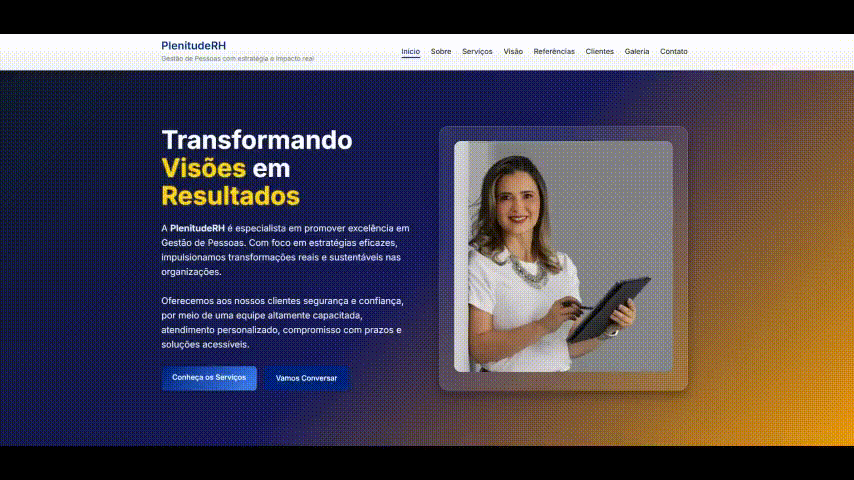

# 🌐 PeopleSolutionsHR – Consultoria em Gestão de Pessoas e RH

## 📖 Sobre o Projeto

O **People Solutions HR** é um site institucional desenvolvido para apresentar a consultoria de **Jaqueline Araújo**, especialista em **Gestão de Pessoas e RH Estratégico**.

O projeto tem como objetivo transmitir credibilidade, destacar serviços oferecidos, apresentar clientes e depoimentos, além de facilitar o contato com potenciais clientes.

## 📷 Preview



## 🛠️ Tecnologias Utilizadas

- **HTML5** → Estrutura do conteúdo
- **CSS3** → Estilização e responsividade
- **JavaScript** → Funcionalidades interativas
- **Formspree** → Integração do formulário de contato
- **Font Awesome** → Ícones
- **Google Fonts (Inter)** → Tipografia

## ⚙️ Recursos Técnicos

- **SEO e Compartilhamento Social**
  - Meta tags (`description`, `robots`)
  - Open Graph (Facebook/LinkedIn) e Twitter Card configurados
  - Dados estruturados JSON-LD (`ProfessionalService`)

- **Responsividade**
  - Layout adaptado para **desktop, tablet e mobile**
  - Uso de **CSS Grid** e **Flexbox**

- **Acessibilidade**
  - Foco visível em elementos interativos

## 🎨 Principais Funcionalidades

### 🔝 Navegação

- Menu fixo no topo com destaque para a seção ativa
- Menu **hambúrguer** responsivo em dispositivos móveis
- Scroll suave entre seções

### 💡 Hero Section

- Mensagem principal de impacto:  
  _“Transformando Visões em Resultados”_
- Botões de chamada para ação (Serviços e Contato)
- Foto da fundadora em destaque

### 👤 Sobre

- Trajetória profissional da consultora

### 🛎️ Serviços

Quatro áreas de atuação estratégicas

### 🌎 Visão

- Pilares estratégicos da consultoria
- Animações com **Intersection Observer**

### 💬 Depoimentos

- Testemunhos reais de clientes e parceiros
- Cards estilizados com nome e cargo

### 🏢 Clientes

- Carrossel automático com logos de empresas parceiras

### 🖼️ Galeria

- Galeria de fotos com **slide automático**
- Navegação manual com setas e pontos interativos

### 📬 Contato

- Informações de contato com links de redirecionamento: **E-mail, WhatsApp e LinkedIn**
- **Formulário de contato** com validação de campos
- Integração com **Formspree** para recebimento de mensagens
- Sistema de **notificações personalizadas**

### 🦶 Rodapé

- Links rápidos de navegação
- Links sociais
- Créditos ao desenvolvedor (**Efraim Silva**)
- Ano atualizado dinamicamente via JavaScript

## 🚀 Como Executar o Projeto

Entre no site: [PeopleSolutionsHR](https://people-solutions-hr.netlify.app)

OU

1. Clone este repositório:
   ```bash
<<<<<<< HEAD
   git clone https://github.com/Efrals/PeopleSolutionsHR-Portfolio-JA.git
=======
   git clone https://github.com/efraimrsilva/PlenitudeRH-Portfolio-JA.git
>>>>>>> cc7268d9dac543e0d1bd968c91cc251c4f8da05b
   ```
2. Acesse a pasta do projeto:
   ```bash
   cd people-solutions-hr
   ```
3. Abra o arquivo `index.html` diretamente no navegador.

## 👩‍💼 Autoria

[**Jaqueline Araújo**](https://www.linkedin.com/in/jaqueline-araujo-/) – Consultora em Gestão de Pessoas e RH Estratégico

## 👨‍💻 Desenvolvimento

Feito com 💖 por [Efraim R. Silva](https://www.linkedin.com/in/efraimrsilva/)
